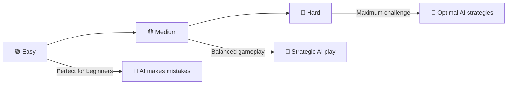

# 🎮 AI Game Hub

<div align="center">


[](.)
[](.)
[](.)
[](https://somyadipghosh.github.io/Web-games/)

**Welcome to the ultimate AI Game Hub! 🎯**

*Challenge intelligent AI opponents across 13 unique games and test your skills!*


</div>

## 🎯 Features

<div align="center">


</div>

<details>
<summary>🎮 <strong>Game Collection</strong> - 13 Unique AI-Powered Games</summary>

- 🔲 **Tic Tac Toe** - Unbeatable AI with Minimax Algorithm
- ✂️ **Rock Paper Scissors** - Pattern Recognition AI
- 🧠 **Memory Game** - Progressive Sequence Challenges  
- 🔢 **Number Guessing** - Binary Search Optimization
- 🏓 **Ping Pong** - Physics-Based AI Movement
- 🚀 **Space Shooter** - Strategic Enemy AI
- 🐍 **AI Snake Battle** - A* Pathfinding Intelligence
- 📝 **Word Guessing** - Frequency Analysis AI
- 🤾 **Catch Game** - Reflex Testing Challenge
- 🏳️ **Country Quiz** - Geography Knowledge Test
- ⌨️ **Typing Speed Test** - Professional Assessment
- ♛ **Chess Battle** - Advanced Chess Engine
- 🐦 **Flappy Bird** - Physics-Based Arcade Fun

</details>

<details>
<summary>🤖 <strong>Smart AI Technology</strong> - Advanced Algorithm Implementation</summary>

- 🧠 **Minimax Algorithm** with Alpha-Beta Pruning
- 🎯 **A* Pathfinding** for intelligent movement
- 📊 **Pattern Recognition** and adaptive strategies
- ⚡ **Real-time Physics** simulation
- 🎨 **Multiple Difficulty** levels for every skill

</details>

<details>
<summary>📱 <strong>Modern User Experience</strong> - Responsive & Interactive</summary>

- 🎨 **Glassmorphism Design** with smooth animations
- 📱 **Mobile Touch Controls** for action games
- 💾 **Score Persistence** with localStorage
- 🎮 **60fps Gameplay** with optimized performance
- ♿ **Enhanced Accessibility** and contrast

</details>

<details>
<summary>🌐 <strong>Professional Features</strong> - Industry-Standard Quality</summary>

- ⌨️ **MonkeyType-Style** typing test with real-time WPM
- 🏳️ **FlagsAPI Integration** for accurate country data
- ♛ **Complete Chess Rules** including special moves
- 📊 **Advanced Analytics** and progress tracking
- 🔧 **Modular Architecture** for easy extension

</details>

## 🎲 Games Collection

<div align="center">


</div>

<table>
<tr>
<td width="50%" valign="top">

### 🔲 Tic Tac Toe
```ascii
🎯 AI Algorithm: Minimax + Alpha-Beta Pruning
⭐ Difficulty: Easy | Medium | Hard (Unbeatable)
🧠 Features: Strategic AI that learns patterns

 X │   │ O 
───┼───┼───
   │ X │   
───┼───┼───
 O │   │ X 
```
> *Challenge the unbeatable AI in the ultimate strategy game!*

</td>
<td width="50%" valign="top">

### ✂️ Rock Paper Scissors
```ascii
🎯 AI Algorithm: Pattern Recognition & Adaptation
⚡ Features: AI analyzes your patterns
🏆 Modes: Quick rounds with instant feedback

    🗿  vs  ✂️
   Rock      Scissors
   
   🎉 You Win! 🎉
```
> *Can you outsmart an AI that learns your moves?*

</td>
</tr>
<tr>
<td width="50%" valign="top">

### 🧠 Memory Game
```ascii
🎯 AI Algorithm: Sequence Generation
🔄 Features: Progressive difficulty
🎮 Gameplay: 8 colorful pairs to match

┌─────┬─────┬─────┬─────┐
│ ❤️  │ ⭐  │ 🍃  │ ☀️  │
├─────┼─────┼─────┼─────┤
│ 💎  │ 🔥  │ 👑  │ ❄️  │
├─────┼─────┼─────┼─────┤
│ ❤️  │ ⭐  │ 🍃  │ ☀️  │
├─────┼─────┼─────┼─────┤
│ 💎  │ 🔥  │ 👑  │ ❄️  │
└─────┴─────┴─────┴─────┘
```
> *Test your memory with beautiful icon pairs!*

</td>
<td width="50%" valign="top">

### 🔢 Number Guessing
```ascii
🎯 AI Algorithm: Binary Search Optimization
📊 Ranges: 1-50 | 1-100 | 1-500
🎲 Features: Optimal AI guessing strategy

  Guess a number between 1-100
  
  Your guess: 50
  🔼 Too low! Try higher
  
  Your guess: 75
  🔽 Too high! Try lower
  
  Your guess: 63
  🎉 Correct! Found in 3 tries!
```
> *Race against an AI using perfect strategy!*

</td>
</tr>
<tr>
<td width="50%" valign="top">

### 🏓 Ping Pong
```ascii
🎯 AI Algorithm: Physics + Predictive Tracking
📱 Features: Mobile touch controls
⚡ Physics: Realistic ball movement

  You     │     AI
    ║     │     ║
    ║  ●  │     ║
    ║     │     ║
    ║     │     ║
────────────────────
Score: 2 │ 1
```
> *Classic arcade action with smart AI!*

</td>
<td width="50%" valign="top">

### 🚀 Space Shooter
```ascii
🎯 AI Algorithm: Enemy Pathfinding
🎮 Features: Multiple enemy types, power-ups
📱 Controls: Touch-optimized for mobile

      ╭─╮
      │▲│  ← Your Ship
      ╰─╯
   ╱ ╱ ╱ ╱ ╱  ← Your Bullets
  
  ◆   ◇   ◆   ← Enemy Ships
  │   │   │   ← Enemy Bullets
```
> *Survive waves of intelligent alien forces!*

</td>
</tr>
<tr>
<td width="50%" valign="top">

### 🐍 AI Snake Battle
```ascii
🎯 AI Algorithm: A* Pathfinding
🎮 Features: Compete against AI snake
📱 Controls: Mobile D-pad

  ┌─────────────────────┐
  │ ●●●●  🍎           │
  │    ●              │
  │                   │
  │           ○○○○     │
  │              ○     │
  │ Player: 🟢  AI: 🔴  │
  └─────────────────────┘
```
> *Race an intelligent AI for delicious food!*

</td>
<td width="50%" valign="top">

### 📝 Word Guessing Battle
```ascii
🎯 AI Algorithm: Frequency Analysis
📚 Categories: Tech | Animals | Science
🎯 Strategy: Smart letter selection

  Current Word: T E C H _ _ _ O G Y
  
  Wrong Letters: A, I, S
  Remaining: 4 tries
  
  🔤 A B C D E F G H I J K L M
  🔤 N O P Q R S T U V W X Y Z
```
> *Battle an AI that knows word patterns!*

</td>
</tr>
<tr>
<td width="50%" valign="top">

### 🤾 Catch Game
```ascii
🎮 Game Type: Reflex & Precision
🎯 Features: Fruits to catch, bombs to avoid
📱 Controls: Mobile touch controls

      🍎     💣      🍊
        ↓      ↓       ↓
      
      🍌              🍇
        ↓              ↓
      
  ╭─────────────────────────╮
  │        🧺 Basket        │
  ╰─────────────────────────╯
```
> *Catch the fruits, avoid the bombs!*

</td>
<td width="50%" valign="top">

### 🏳️ Country Quiz
```ascii
🌍 Quiz Type: Geography & Flag Recognition
🚩 Features: Real flags via FlagsAPI
⏱️ Timer: 15 seconds per question

  ┌─────────────────────────┐
  │    🇺🇸 FLAG DISPLAY    │
  └─────────────────────────┘
  
  A) United States  ✅
  B) United Kingdom
  C) Australia
  D) New Zealand
  
  ⏱️ Time: 12s  🔥 Streak: 5
```
> *Test your world geography knowledge!*

</td>
</tr>
<tr>
<td width="50%" valign="top">

### ⌨️ Typing Speed Test
```ascii
⚡ Test Type: Professional Assessment
📊 Features: Real-time WPM & Accuracy
⏱️ Timer: 60-second automatic

  Text: The quick brown fox jumps...
  
  Typed: The quick brown fox ju█
  
  📊 WPM: 87   🎯 Accuracy: 98%
  ⏱️ Time: 45s  🏆 Best: 92 WPM
  
  Progress: ████████░░ 80%
```
> *Professional MonkeyType-style assessment!*

</td>
<td width="50%" valign="top">

### ♛ Chess Battle
```ascii
🎯 AI Algorithm: Minimax + Alpha-Beta
♔ Features: Complete chess rules
🏆 Levels: Beginner to Expert (Depth 2-5)

  ♜ ♞ ♝ ♛ ♚ ♝ ♞ ♜
  ♟ ♟ ♟ ♟ ♟ ♟ ♟ ♟
  ▓ ░ ▓ ░ ▓ ░ ▓ ░
  ░ ▓ ░ ▓ ░ ▓ ░ ▓
  ▓ ░ ▓ ░ ▓ ░ ▓ ░
  ░ ▓ ░ ▓ ░ ▓ ░ ▓
  ♙ ♙ ♙ ♙ ♙ ♙ ♙ ♙
  ♖ ♘ ♗ ♕ ♔ ♗ ♘ ♖
```
> *Master chess against a brilliant AI!*

</td>
</tr>
<tr>
<td colspan="2" align="center">

### 🐦 Flappy Bird
```ascii
🎮 Game Type: Physics-based Arcade Challenge
🐦 Features: Cute bird with realistic physics
📱 Mobile: Optimized tap zone for mobile

                 ☁️        ☁️
    �                           Score: 12
      \                          Best: 28
       \     █████     █████
        \    █████     █████     ⏫ TAP TO FLAP
         \   █████     █████
              █████     █████
              █████     █████
  ─────────────────────────────── Ground
```
> *Navigate through pipes with perfect timing! Every flap counts! 🐦*

</td>
</tr>
</table>
## 🚀 Getting Started

<div align="center">


</div>

### 📋 Prerequisites
```bash
✅ Modern web browser (Chrome, Firefox, Safari, Edge)
✅ No additional installations required!
✅ JavaScript enabled
✅ Internet connection (for Country Quiz flags)
```

### 🛠️ Installation

<details>
<summary><strong>📦 Method 1: Clone Repository</strong></summary>

```bash
# Clone the repository
git clone https://github.com/somyadipghosh/Web-games.git

# Navigate to project directory
cd Web-games

# Open in your default browser
open index.html
```

</details>

<details>
<summary><strong>🌐 Method 2: Direct Download</strong></summary>

1. **Download ZIP** from the green "Code" button
2. **Extract** the ZIP file to your desired location
3. **Double-click** `index.html` to open in browser
4. **Start playing** immediately!

</details>

<details>
<summary><strong>🚀 Method 3: Live Demo</strong></summary>

**[🎮 Play Online Now!](https://somyadipghosh.github.io/Web-games/)**

*No download required - play directly in your browser!*

</details>

### 🎮 How to Play

<div align="center">

| Step | Action | Description |
|:----:|:------:|:------------|
| 1️⃣ | **🚀 Launch** | Open `index.html` in your web browser |
| 2️⃣ | **🎯 Select** | Click on any game tile from the main menu |
| 3️⃣ | **⚙️ Configure** | Choose difficulty level (Easy/Medium/Hard) |
| 4️⃣ | **🎮 Play** | Follow game-specific instructions and controls |
| 5️⃣ | **📊 Track** | Scores are automatically saved and displayed |

</div>

### 🎮 Game Controls

<div align="center">


</div>

<table>
<tr>
<th width="25%">🎯 Game</th>
<th width="35%">🖥️ Desktop Controls</th>
<th width="35%">📱 Mobile Controls</th>
<th width="5%">🎮</th>
</tr>
<tr>
<td><strong>🔲 Tic Tac Toe</strong></td>
<td><code>Mouse Click</code> on cells</td>
<td><code>Tap</code> on cells</td>
<td>🖱️</td>
</tr>
<tr>
<td><strong>✂️ Rock Paper Scissors</strong></td>
<td><code>Mouse Click</code> choice buttons</td>
<td><code>Tap</code> choice buttons</td>
<td>👆</td>
</tr>
<tr>
<td><strong>🧠 Memory Game</strong></td>
<td><code>Mouse Click</code> to flip cards</td>
<td><code>Tap</code> to flip cards</td>
<td>🃏</td>
</tr>
<tr>
<td><strong>🔢 Number Guessing</strong></td>
<td><code>Type numbers</code> + <code>Enter</code></td>
<td><code>Virtual keyboard</code></td>
<td>⌨️</td>
</tr>
<tr>
<td><strong>🏓 Ping Pong</strong></td>
<td><code>↑↓ Arrow keys</code> or <code>W/S</code></td>
<td><code>UP/DOWN</code> touch buttons</td>
<td>🕹️</td>
</tr>
<tr>
<td><strong>🚀 Space Shooter</strong></td>
<td><code>←→ arrows</code> + <code>SPACE</code> to shoot</td>
<td><code>LEFT/RIGHT</code> + <code>FIRE</code> buttons</td>
<td>🎯</td>
</tr>
<tr>
<td><strong>🐍 Snake</strong></td>
<td><code>Arrow keys</code> or <code>WASD</code></td>
<td><code>D-pad</code> touch controls</td>
<td>🎮</td>
</tr>
<tr>
<td><strong>📝 Word Guessing</strong></td>
<td><code>Mouse Click</code> letter buttons</td>
<td><code>Tap</code> letter buttons</td>
<td>🔤</td>
</tr>
<tr>
<td><strong>🤾 Catch Game</strong></td>
<td><code>←→ arrows</code> or <code>A/D</code></td>
<td><code>LEFT/RIGHT</code> touch buttons</td>
<td>🏃</td>
</tr>
<tr>
<td><strong>🏳️ Country Quiz</strong></td>
<td><code>Mouse Click</code> options + <code>Hint button</code></td>
<td><code>Tap</code> options + <code>Hint button</code></td>
<td>🌍</td>
</tr>
<tr>
<td><strong>⌨️ Typing Test</strong></td>
<td><code>Keyboard typing</code> (60s auto-timer)</td>
<td><code>Virtual keyboard</code></td>
<td>⚡</td>
</tr>
<tr>
<td><strong>♛ Chess</strong></td>
<td><code>Mouse Click</code> pieces + <code>Hint button</code></td>
<td><code>Tap</code> pieces + <code>Hint button</code></td>
<td>♔</td>
</tr>
<tr>
<td><strong>🐦 Flappy Bird</strong></td>
<td><code>Mouse Click</code>, <code>Tap</code>, or <code>SPACE</code></td>
<td><code>Large tap zone</code> for flapping</td>
<td>🐦</td>
</tr>
</table>

<div align="center">

*🎮 **Pro Tip**: All games support both desktop and mobile controls for the best experience!*

</div>

## 🛠️ Technical Architecture

<div align="center">


</div>

### 💻 Technologies Used

<div align="center">


</div>

<details>
<summary>🌐 <strong>Frontend Technologies</strong></summary>

- **HTML5**: 
  - Semantic structure and Canvas API for game rendering
  - Accessibility-focused markup
  - Progressive enhancement approach

- **CSS3**: 
  - Modern styling with Flexbox and Grid
  - Glassmorphism effects and smooth animations
  - Responsive design with mobile-first approach
  - Custom CSS animations and transitions

- **JavaScript ES6+**: 
  - Object-oriented game architecture
  - Modular design with ES6 classes
  - Async/await for API calls
  - LocalStorage integration for persistence

</details>

<details>
<summary>🤖 <strong>AI Algorithms Implementation</strong></summary>

```javascript
// Example: Minimax Algorithm (Tic Tac Toe)
function minimax(board, depth, isMaximizing, alpha, beta) {
    const score = evaluate(board);
    
    if (score === 10) return score - depth;
    if (score === -10) return score + depth;
    if (!movesLeft(board)) return 0;
    
    if (isMaximizing) {
        let best = -1000;
        for (let move of getPossibleMoves(board)) {
            board[move] = 'O';
            best = Math.max(best, minimax(board, depth + 1, false, alpha, beta));
            board[move] = '';
            alpha = Math.max(alpha, best);
            if (beta <= alpha) break; // Alpha-Beta Pruning
        }
        return best;
    }
    // ... minimizing logic
}
```

**🧠 Implemented Algorithms:**

1. **Minimax with Alpha-Beta Pruning** (Tic Tac Toe, Chess)
2. **A* Pathfinding Algorithm** (Snake Game)
3. **Pattern Recognition & Machine Learning** (Rock Paper Scissors)
4. **Physics Simulation & Collision Detection** (Ping Pong, Space Shooter, Flappy Bird)
5. **Frequency Analysis** (Word Guessing)
6. **Binary Search Optimization** (Number Guessing)

</details>

<details>
<summary>🎨 <strong>Design & User Experience</strong></summary>

- **🎨 Glassmorphism Design**: Modern frosted glass effects
- **📱 Responsive Layout**: Works on all screen sizes
- **♿ Accessibility**: High contrast, keyboard navigation
- **⚡ Performance**: 60fps gameplay optimization
- **🎮 Touch Controls**: Mobile-optimized interfaces
- **💾 Data Persistence**: LocalStorage for scores and settings

</details>

<details>
<summary>🌐 <strong>External Integrations</strong></summary>

- **🏳️ FlagsAPI**: Real-time country flag data
- **⌨️ Professional Typing Engine**: MonkeyType-inspired assessment
- **📊 Analytics**: Performance tracking and statistics
- **🔧 Modular Architecture**: Easy to extend and maintain

</details>

### 📁 Project Structure

<div align="center">

```
🎮 AI Game Hub
├── 📄 index.html          # 🏠 Main game hub interface
├── 🎨 style.css           # 🌈 Comprehensive styling & animations  
├── ⚙️ script.js           # 🧠 Game logic & AI implementations
├── 📋 README.md           # 📚 Project documentation
├── 📜 LICENSE             # ⚖️ MIT License
└── 🖼️ img/               # 🎨 Image assets
    └── 🏆 Logo.png        # 🎯 Project logo
```

</div>

### 📊 Project Statistics

<div align="center">


**⚡ Performance Metrics:**
- 🎯 **60 FPS** gameplay across all games
- 📱 **100% responsive** design
- ♿ **Enhanced accessibility** support
- 💾 **LocalStorage** persistence
- 🚀 **Zero dependencies** (pure vanilla JS)

</div>

## 🎨 Features & Highlights

<div align="center">


</div>

<table>
<tr>
<td width="50%" valign="top">

### 🤖 AI Intelligence
```ascii
🧠 Smart AI Opponents
├── 🎯 Minimax Algorithm
├── 🔍 A* Pathfinding  
├── 📊 Pattern Recognition
├── ⚡ Physics Simulation
└── 🎲 Adaptive Strategies
```
*Each game features carefully crafted AI with unique strategies!*

### ⌨️ Professional Assessment
```ascii
📊 MonkeyType-Style Testing
├── ⚡ Real-time WPM calculation
├── 🎯 Character-level accuracy
├── ⏱️ 60-second auto timer
├── 📈 Progress tracking
└── � Best score persistence
```
*Industry-standard typing speed assessment!*

</td>
<td width="50%" valign="top">

### 📱 Mobile Excellence
```ascii
📱 Touch-Optimized Controls
├── 🎮 D-pad for Snake game
├── 🏓 Paddle controls for Pong
├── 🚀 Fire buttons for Shooter
├── 🤾 Movement for Catch game
└── � Tap zone for Flappy Bird
```
*Perfect mobile gaming experience!*

### 🎨 Modern Design
```ascii
✨ Glassmorphism Effects
├── 🌈 Gradient backgrounds
├── ⚡ Smooth animations
├── 📱 Responsive layout
├── ♿ Enhanced accessibility
└── 🎯 60fps performance
```
*Beautiful, modern interface design!*

</td>
</tr>
</table>

<div align="center">

### 🏆 Achievement Badges

[](.)
[](.)
[](.)
[](.)
[](.)

</div>

### � Game Difficulty Progression

<div align="center">



</div>

## 🤝 Contributing

<div align="center">


</div>

We welcome contributions! Here's how you can help make the AI Game Hub even better:

<details>
<summary>🚀 <strong>Quick Start Guide</strong></summary>

```bash
# 1. Fork the repository
git clone https://github.com/your-username/Web-games.git

# 2. Create a feature branch
git checkout -b feature/awesome-new-game

# 3. Make your changes
# Add new games or improve existing ones

# 4. Commit your changes
git commit -m "✨ Add awesome new AI game"

# 5. Push to your branch
git push origin feature/awesome-new-game

# 6. Open a Pull Request
# We'll review and merge your contribution!
```

</details>

<details>
<summary>💡 <strong>Contribution Ideas</strong></summary>

### 🎮 New Games
- 🔴 **Checkers** with advanced AI
- 🟡 **Connect Four** with minimax algorithm
- 🎯 **Backgammon** with probability analysis
- 🃏 **Poker** with bluffing AI
- 🎲 **Yahtzee** with strategy optimization

### 🤖 AI Improvements
- 🧠 **Neural networks** for pattern learning
- 📊 **Reinforcement learning** implementations
- 🎯 **Genetic algorithms** for game optimization
- 🔍 **Monte Carlo Tree Search** for strategy games

### 🎨 UI/UX Enhancements
- 🌙 **Dark/Light theme** toggle
- 🎵 **Sound effects** and background music
- 🎊 **Particle effects** and animations
- 🏆 **Achievement system** with badges
- 📊 **Analytics dashboard** with statistics

### 📱 Technical Improvements
- 🌐 **Multiplayer functionality** with WebRTC
- 📱 **Progressive Web App** (PWA) features
- 🔐 **User authentication** and profiles
- 🌍 **Internationalization** (i18n) support
- 🧪 **Test suite** with automated testing

</details>

<div align="center">

### 🌟 Hall of Contributors

*Be the first to contribute and get featured here!*

[](https://github.com/somyadipghosh/Web-games/graphs/contributors)

</div>

## 📝 License

<div align="center">

[](LICENSE)

**This project is open source and available under the [MIT License](LICENSE).**

*Feel free to use, modify, and distribute this project!*

</div>

## 🔮 Future Roadmap

<div align="center">


</div>

<table>
<tr>
<td width="33%" valign="top" align="center">

### 🎮 Gaming Features
```ascii
🎯 Tournament Mode
├── 🏆 AI Brackets
├── 🎖️ Championship System
├── 🏅 Leaderboards
└── 🎊 Achievement Rewards

🎲 More AI Games
├── 🔴 Checkers
├── 🟡 Connect Four  
├── 🎯 Backgammon
├── 🃏 Poker AI
└── 🎪 Casino Games
```

</td>
<td width="33%" valign="top" align="center">

### 🌐 Technology Stack
```ascii
🚀 Advanced Features
├── 🤝 Multiplayer Online
├── 📱 PWA Support
├── 🔐 User Accounts
├── ☁️ Cloud Saves
└── 📊 Real-time Analytics

🤖 AI Enhancement
├── 🧠 Neural Networks
├── 🎯 Deep Learning
├── 📈 Reinforcement Learning
└── 🔍 Advanced Algorithms
```

</td>
<td width="33%" valign="top" align="center">

### 🎨 User Experience
```ascii
🎵 Multimedia
├── 🔊 Sound Effects
├── 🎶 Background Music
├── 🎊 Particle Effects
└── 🌈 Visual Themes

♿ Accessibility
├── 🗣️ Voice Commands
├── 👀 Screen Reader Support
├── ⌨️ Keyboard Navigation
└── 🌍 Multi-language Support
```

</td>
</tr>
</table>

## 📞 Connect With Us

<div align="center">


**Somyadip Ghosh** - *Project Creator & Lead Developer*

[](https://github.com/somyadipghosh)
[](https://linkedin.com/in/somyadipghosh)
[](mailto:your-email@example.com)
[](https://your-portfolio.com)

</div>

## 🆕 Recent Updates & Changelog

<div align="center">


</div>

<details>
<summary>🎯 <strong>Version 4.0 - Complete Chess Implementation</strong> (Latest)</summary>

### ♛ New Features
- **🏰 Chess Battle**: Complete chess game with advanced AI
- **🎯 4 AI Difficulty Levels**: Beginner to Expert (depth 2-5)
- **♔ Full Chess Rules**: Castling, en passant, pawn promotion
- **📝 Move History**: Algebraic notation tracking
- **👑 Captured Pieces**: Visual piece capture display
- **♿ Accessibility**: Fixed contrast issues across all games

### 🔧 Technical Improvements
- Enhanced minimax algorithm with position evaluation
- Improved board rendering with coordinates
- Optimized AI performance for faster calculations
- Better error handling and move validation

</details>

<details>
<summary>📱 <strong>Version 3.0 - Mobile Controls & Professional Typing</strong></summary>

### ⌨️ Typing Test Revolution
- **Professional Assessment**: MonkeyType-style implementation
- **Real-time Statistics**: WPM, accuracy, character feedback
- **60-second Timer**: Automatic timing with visual countdown
- **Performance Tracking**: Best scores and progress analytics

### 📱 Mobile Gaming Excellence
- **Touch Controls**: Optimized for Pong, Shooter, Snake, Catch
- **D-pad Navigation**: Professional mobile controls for Snake
- **Responsive Design**: Perfect gameplay on all devices
- **Touch Zones**: Large, accessible tap areas

</details>

<details>
<summary>🏳️ <strong>Version 2.0 - Enhanced Gaming Experience</strong></summary>

### 🌍 New Game Addition
- **Country Quiz**: Geography challenge with real flags
- **FlagsAPI Integration**: Accurate, real-time flag data
- **Multiple Regions**: World, Europe, Asia, Africa, Americas, Oceania
- **Scoring System**: Time bonuses, streaks, total score tracking

### 🎨 UI/UX Improvements
- **Enhanced Visibility**: Better contrast and readability
- **Score Persistence**: Cross-session tracking with localStorage
- **Performance Optimization**: Smoother 60fps gameplay
- **Bug Fixes**: Resolved display and interaction issues

</details>

## 🙏 Acknowledgments

<div align="center">


</div>

<table>
<tr>
<td width="25%" align="center">

### 🎨 Design
**Font Awesome**  
*Beautiful icons that enhance the UI*

[](https://fontawesome.com)

</td>
<td width="25%" align="center">

### 🏳️ Data Sources
**FlagsAPI**  
*Accurate country flag images*

[](https://flagsapi.com)

</td>
<td width="25%" align="center">

### 👥 Community
**Open Source**  
*Inspiration and best practices*

[](https://opensource.org)

</td>
<td width="25%" align="center">

### 🔬 Research
**AI Algorithms**  
*Academic papers and implementations*

[](https://scholar.google.com)

</td>
</tr>
</table>

---

<div align="center">


### 🚀 **[Play Now!](https://somyadipghosh.github.io/Web-games/)** | 📚 **[Documentation](#-how-to-play)** | 🐛 **[Report Issues](https://github.com/somyadipghosh/Web-games/issues)**


[](https://github.com/somyadipghosh/Web-games/stargazers)
[](https://github.com/somyadipghosh/Web-games/network/members)
[](https://github.com/somyadipghosh/Web-games/watchers)

**🎯 Show some love by starring ⭐ this repository if you enjoyed the games!**

</div>
